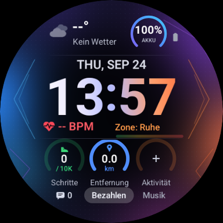

# Aurora – Wear OS Watch Face

Ein Zifferblatt für Wear OS im [Watch Face Format](https://developer.android.com/training/wearables/wff) (WFF v2) mit Aurora-Hintergrund, großer Digitaluhr und Fitness-/Wetterdaten.



## Features

- Digitaluhr (12h/24h je nach Systemeinstellung), eigene Ambient-Darstellung
- Wetter: Temperatur (°C/°F) und Zustands-Icon (Sonne, Mond, Wolken, Regen, Schnee, Gewitter, Nebel, Wind)
- Herzfrequenz mit Pulszonen, Akkustand, ungelesene Benachrichtigungen
- Drei Complication-Slots als Fortschrittsringe – standardmäßig mit Fitbit-Datenquellen belegt:
  - **Schritte** (Ziel aus `STEP_GOAL`, Fallback 10.000)
  - **Aktivität** (Aktivzonenminuten)
  - **Entfernung** (ohne Datenquelle: Schätzung aus Schritten, 75 cm Schrittlänge)

## Projektstruktur

```
watchface/src/main/res/raw/watchface.xml   # WFF-Layout (generiert)
watchface/src/main/res/drawable/           # Hintergrund, Icons, Vorschau (generiert)
tools/watchface/aurora_base.xml            # statisches Basis-Layout
tools/watchface/gen_xml.py                 # erzeugt watchface.xml inkl. Complication-Slots
tools/watchface/gen_assets.py              # erzeugt die Bitmaps (Pillow + NumPy)
```

## Bauen & Installieren

Voraussetzungen: Android Studio / Android SDK (compileSdk 37, minSdk 34), JDK.

```sh
./gradlew :watchface:assembleDebug
adb install -r watchface/build/outputs/apk/debug/watchface-debug.apk
```

Danach auf der Uhr das Zifferblatt **Aurora** auswählen.

> Hinweis: Die Uhr speichert die gewählten Datenquellen pro Slot-Position. Nach Änderungen an
> Anzahl/Reihenfolge der Slots die App vorher deinstallieren (`adb uninstall com.example.mywatchface`).

## Assets & Layout neu generieren

```sh
pip install pillow numpy
python3 tools/watchface/gen_assets.py
python3 tools/watchface/gen_xml.py
```
